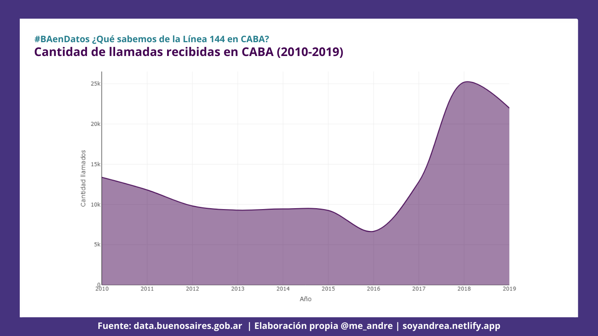
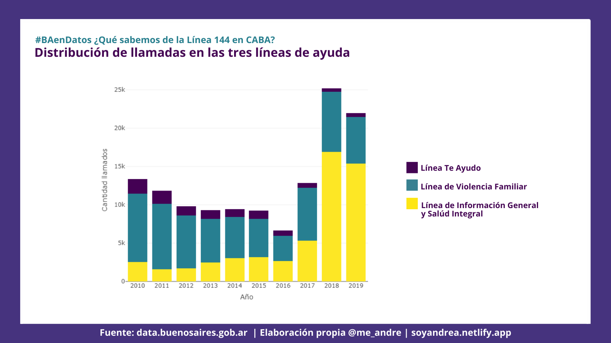

Me sume al [**desafío de #BAenDatos**](https://www.buenosaires.gob.ar/agendadetransparencia/datos-abiertos/baendatos) con un serie de visualizaciones sobre género y encontré información interesante  para compartir sobre la línea nacional para la atención, contención y asesoramiento en situaciones de violencia por razones de género


Para esto usé dos datasets: [**Llamadas linea 144**](https://data.buenosaires.gob.ar/dataset/llamadas-linea-144/archivo/72a45383-d48d-468a-a39b-051cc3ec239c) y [**Conocimiento de dispositivos de asistencia**](https://data.buenosaires.gob.ar/dataset/servicios-asistencia-victimas-violencia-genero/archivo/598323e9-4df6-4465-9785-b9591bc32a77), ambos en formato CSV

```{r message=FALSE, warning=FALSE}
#Las librerias a usar fueron tidyverse y plotly, acá te comparto el script usado para las visualizaciones.
library(tidyverse)
library(plotly)
```

**La línea 144 es el segundo dispositivo de asistencia más conocido en CABA** por las mujeres al momento de buscar atención, contención y asesoramiento ante situaciones de violencia por razones de género. ¿Cómo es esto posible?

```{r message=FALSE, warning=FALSE, paged.print=FALSE}
df_dispositivos <- read.csv("lin_tel_ayu_annio__ser_asist_limpio.csv", sep = ";", encoding = "latin1")
df_dispositivos[,-1]

df_dispositivos <- df_dispositivos[order(df_dispositivos$porc_mujeres),]

df_dispositivos$porc_fact <- factor(df_dispositivos$porc_mujeres, levels =df_dispositivos[["porc_mujeres"]])

yform <- list(categoryorder = "array",
              categoryarray = df_dispositivos$porc_fact,
              title = "")

fig <- plot_ly(df_dispositivos, x = ~porc_fact, y = ~servicios_asistencia ,  type = 'bar', orientation = 'h', marker = list(color = c(
                                'rgba(39,127,142,1)',
                                'rgba(39,127,142,1)',
                                'rgba(39,127,142,1)', 
                                'rgba(39,127,142,1)',
                                'rgba(39,127,142,1)',
                                'rgba(39,127,142,1)',
                                'rgba(70,51,126,1)',
                                'rgba(39,127,142,1)'))) %>% 
  layout(xaxis = list(title = 'Porcentaje de conocimiento'),
         title = "Conocimiento de dispositivos de asistencia",
         yaxis = yform)

fig
```


La [**línea 144**](https://www.argentina.gob.ar/generos/linea-144) fue creada para cumplir los objetivos establecidos por la Ley 26.485 sobre protección integral para prevenir, sancionar y erradicar la violencia contra las mujeres en los ámbitos en que desarrollen sus relaciones interpersonales (artículo 9), sancionada en 2009 por el Congreso de la Nación Argentina. 

Desde 2010 a la fecha, la línea 144 cumple la función de atender situaciones de violencia por razones de género las 24hrs, los 365 días en todo el país. En CABA hay un promedio de 12.900 llamadas anuales, aunque desde 2017 el total de llamadas recibidas ha incrementado un 100% de su promedio. 

### ¿Qué pasó en esos años? 



De la mano del [**#NiUnaMenos**](http://niunamenos.org.ar/),  la políticas públicas para la erradicación de la violencia hacia las mujeres fue ampliando el acceso a sus vías de comunicación. 

Ya desde 2015 se impulsó una campaña para que los medios de comunicación informaran sobre la existencia de la línea 144, para 2016 se presenta el [**Plan Nacional**](https://www.argentina.gob.ar/noticias/el-presidente-macri-presento-el-plan-nacional-para-la-erradicacion-de-la-violencia-de) de Acción para la Prevención, Asistencia y Erradicación de la Violencia contra las Mujeres 2017-2019 en el que se incluyeron campañas de difusión y concientización sobre la violencia de género.

Entre 2017 y 2018 el Ministerio de Desarrollo Social lanzó diversas campañas para el día de los enamorados  para alertar sobre noviazgos violentos como "noviazgos sin violencia" y  “¿Te Ama?”. Desde el GCBA lanzaron el test online para detectar noviazgos violentos. Entre tanto la línea 144 para 2017 fue habilitada por las empresas de telefonía celular como [**línea  gratuita**](https://www.lanacion.com.ar/tecnologia/llamar-a-la-linea-144-para-hacer-denuncias-por-violencia-de-genero-sera-gratis-nid2091409/)  y para 2018 fue lanzada la [**aplicación móvil gratuita**](https://www.telam.com.ar/notas/201803/262749-presentaron-la-aplicacion-para-celulares-del-144-para-asistir-a-la-mujeres-las-24-horas.html) de la misma línea para IOS y android. Esto implicó que para comunicarse con la línea 144 ya no fuera necesario contar con saldo o datos móviles.

Así mismo, no hay que dejar de lado los hechos sociales que acompañaron a la sociedad Argentina en 2018 que tuvieron gran repercusión a nivel nacional e internacional en los que se encuentran el debate por la interrupción voluntaria del embarazo y la [**denuncia de Thelma Fardin**](https://www.telam.com.ar/notas/201812/313986-tras-la-denuncia-aumentaron-las-consultas-en-la-linea-de-violencia-de-genero.html). 


2018 ha sido el año con mayor cantidad de llamados a la línea llegando a un total de 25.197. Dentro de las estadísticas está contemplado que los hechos de público conocimiento o movilizaciones referidas a la misma temática intensifican la comunicación con la línea. 


Las comunicaciones al 144 se han distribuido en 3 líneas de ayuda de CABA que permiten orientar el  tipo de consultas o asistencias a realiziar. Cabe destacar que la línea que más volumen de llamadas ha tenido es la Línea de Información General y Salud Integral, es clara la **demanda por información.**  

 


Cada línea cuenta con un **enfoque de atención: salud, vida familiar y adolescencia.** En términos generales en cada ámbito se comunican para solicitar información y para buscar asesoría y contención en situaciones de violencia. Es importante recordar que la línea 144  no se trata de una línea de emergencia.


Para 2020 con el impacto del ASPO la atención de la línea 144 se extendió a whatsapp y mail.

**Recuerda que podés comunicarte de manera gratuita las 24 hs., los 365 días, a través de un llamado al 144, por WhatsApp al 1127716463, por mail a linea144@mingeneros.gob.ar y descargando la app.**


<blockquote class="twitter-tweet"><p lang="es" dir="ltr"><a href="https://twitter.com/hashtag/BAenDatos?src=hash&amp;ref_src=twsrc%5Etfw">#BAenDatos</a> ¿Qué sabemos de la Línea 144 en CABA?<br>Me sumé al desafío de <a href="https://twitter.com/BAGobAbierto?ref_src=twsrc%5Etfw">@BAGobAbierto</a> &amp; <a href="https://twitter.com/BAinnovacion?ref_src=twsrc%5Etfw">@BAinnovacion</a>, y encontré información interesante sobre la línea 144 para compartir.<br><br>Mirá el análisis completo en <a href="https://t.co/9wEvCQHDlT">https://t.co/9wEvCQHDlT</a><a href="https://twitter.com/hashtag/rladies?src=hash&amp;ref_src=twsrc%5Etfw">#rladies</a> <a href="https://t.co/eAnJZFO8Ls">pic.twitter.com/eAnJZFO8Ls</a></p>&mdash; andrea (@me_andre) <a href="https://twitter.com/me_andre/status/1376404024342278144?ref_src=twsrc%5Etfw">March 29, 2021</a></blockquote> <script async src="https://platform.twitter.com/widgets.js" charset="utf-8"></script>


