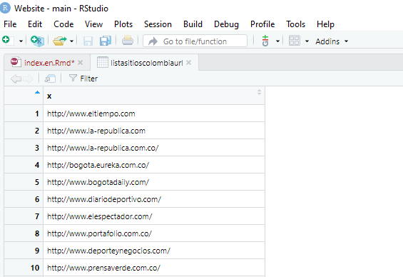

### ¿Por qué linkbuilding?

Parte del desarrollo de estrategias SEO offpage es la generación de enlaces externos conocidos como backlinks. Para esto, es necesario contar con un listado de sitios disponibles para generarlos y es indispensable actualizarlo constantemente.

¿cómo buscarlos? Hay diferentes formas pero depende principalmente de tu objetivo de búsqueda o target. Una de ellas es a través de webscraping si quieres un listado masivo de sitios, en este caso: directorios de prensa. 


#### Librerias a utilizar
Antes de iniciar es necesario que cuentes con los siguientes paquetes de R, sino los tienes los instalas con install.packages("nombre de paquete"): **Rvest,tidyverse y xm12**. Una vez instalados, los activás con la función de library:

```{r message = FALSE, warning=FALSE}
library(tidyverse)
library(rvest)
library(xml2)
```
Por otro lado contamos con el sitios  web a scrapear que en este caso es un directorio de prensa de destintos paises a nivel regional. Para probar el código elegimos un país: Colombia.

##### Agregar sitio a scrapear
Copiamos la URL completa para leer y filtrar la información que necesitamos: Nombre del sitio + URL 

```{r}
#LECTURA HTML DEL SITIO
sitioscolombia <- read_html("https://www.mediosmedios.com.ar/A.%20Colombia.htm")
```

Ahora, queremos ver en detalle la URL de los sitios que nos detalla el listado del directorio y guardarla como primer lista que llamaré lista_sitios_colombia_url

```{r}
#PARA SCRAPEAR LAS URLS QUE QUEREMOS
listasitioscolombiaurl <- sitioscolombia %>% html_nodes("li") %>% html_nodes('a') %>% html_attr('href')
```

Con esta opción lograremos ver el primer listado

```{r}
#ACÁ VAS A ENCONTRAR EL LISTADO DE URLS
view(listasitioscolombiaurl)
```



Ahora queremos sumarle el nombre del sitio donde estaba anclada la URL del sitio 

```{r}
#PARA SCRAPEAR LOS NOMBRES DE LOS SITIOS
listasitiosnombre <- sitioscolombia %>% html_nodes("li") %>% html_nodes('a') %>% html_text() %>% str_remove_all('\\n') %>% str_remove_all('\\r') %>% str_replace_all("\\s*", " ")

```

Y si queremos desplegar el listado ejecutamos la misma función de _view_

```{r}
View(listasitiosnombre)
```

.png)

##### DataFrame para recopilar nombre de medios y URL 
Ahora queremos unificar los listados obtenidos para tener nuestra lista de medios completa
```{r}
df_sitios <- data.frame(listasitiosnombre, listasitioscolombiaurl)
View(df_sitios)
```

.png)

Es hora de exportar nuestro listado para poder trabajarlo en otras herramientas ya sea google sheets, screaming fog u otras APIs

##### Exportamos información en CSV
El formato CSV es el mas recomendado pero puedes optar por otras opciones que ofrece la opción _write._ y le asignas el nombre de archivo en la opción _file = nombre de tu archivo_

```{r}
write.csv(df_sitios, file = "sitioscolombia.csv", row.names = FALSE)
```

El documento estará en la carpeta donde trabajes el proyecto o RMD actual

.png)

##### ¿Qué sigue?

APIs


#### Fuentes y recursos
hola hola


