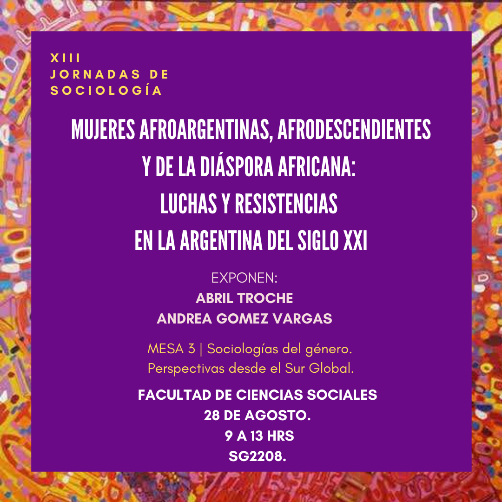
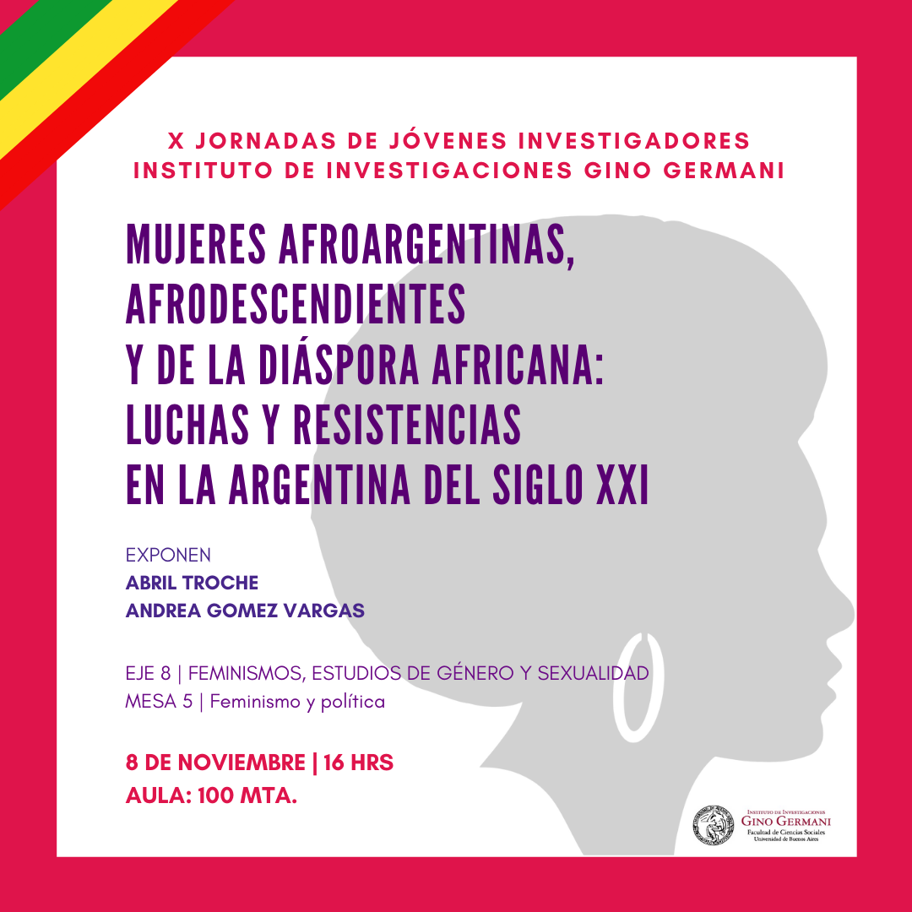

### Mujeres afroargentinas, afrodescendiendes y de la diáspora africana: luchas y resistencias en la Argentina del siglo XXI

_Autoria de Abril Troche (UBA Sociales) y Andrea Gomez Vargas (UBA Sociales)_

Este trabajo se propuso dar cuenta de la creación del área de género que se formó dentro de la Comisión Organizadora 8 de Noviembre. Integrada por la diáspora africana que residen en el territorio argentino y que consagra un proceso de reivindicación, de búsquedas, de reparación y organización histórica, que parte de la construcción del Estado-Nación como proceso colonial, eurocéntrico, blanqueado y negacionista ante la identidad negra en Argentina. Por consiguiente, pretendemos exponer las experiencias colectivas de las mujeres afroargentinas, afrodescendientes y de la diáspora africana que lo componen y la intersección de opresiones que se ven atravesadas dentro del sistema capitalista patriarcal racialmente estructurado.

**Ponencia presentada en las XIII Jornadas de Sociología  UBA Sociales 2019 y en las X jornadas de jóvenes investigadores de Gino Germani 2019.**

