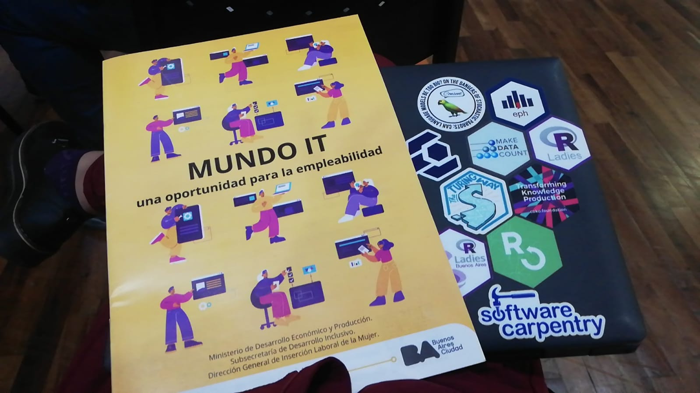
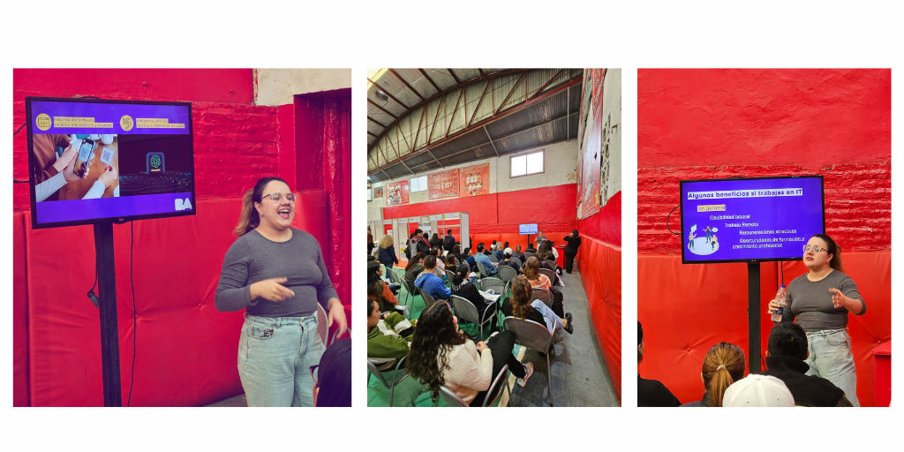

#### _Un proyecto desde la Dirección General de Inserción Laboral de la Mujer del Gobierno de la Ciudad de Buenos Aires en conjunto con la UBA_

Elaborado junto a la dirección, se desarrolla la capacitación Mujeres & IT para el Programa de habilidades para la empleabilidad.

En esta charla se abordan las temáticas de Economía del Conocimiento y Tecnologías de la Información (IT) como una oportunidad de empleo para las mujeres en especial, dada su gran rol en la actividad económica en estos tiempos, es el espacio para contarles  qué significa que cada vez seamos más mujeres en IT, que ventajas y beneficios se pueden obtener con este tipo de empleos, los diferentes puestos y las diferentes modalidades para empezar a aprender un nuevo oficio en tecnología y cuáles son las opciones gratuitas y pagas con las que pueden iniciar su carrera en IT, y sin dejar de lado las comunidades de práctica que pueden acompañar este proceso. 

### Algunas de las participaciones

### Cartilla elaborada para entregar a participantes de MUNDO IT

Se participaron en diferentes jornadas de expo empleo como expo empleo joven, expo empleo barrial UBA-FCE, expo empleo barrial en comunas y expo mujeres productivas. Acá dejo algunos registros de la jornada. 

### Ciclo de charlas en expo empleo barrial

### Charla en expo mujeres productivas

