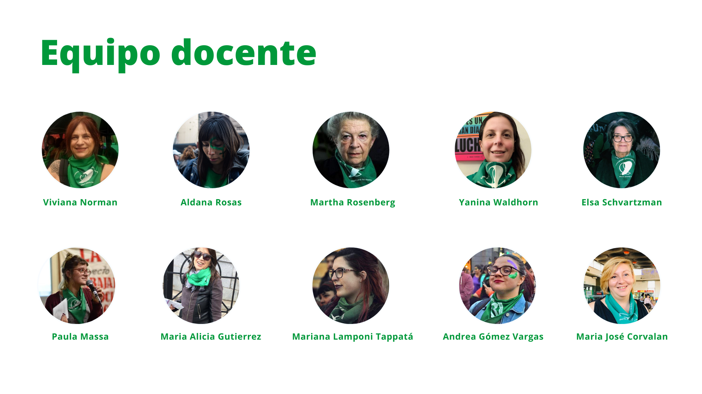

## CATEDRA LIBRE VIRTUAL DE LA CAMPAÑA NACIONAL POR EL DERECHO AL ABORTO LEGAL, SEGURO Y GRATUITO

##### FACULTAD DE CIENCIAS SOCIALES - UBA  
##### COHORTE 2019 -2020

La propuesta se encuadra en la necesidad de que lxs futurxs profesionales en ciencias sociales y lxs asistentes a este seminario adquieran herramientas teóricas y prácticas y un conocimiento inicial pero abarcativo sobre la necesidad de despenalizar y legalizar el aborto para solucionar los problemas que crea la clandestinidad de su práctica.

**Encuentro 1** De las luchas por el aborto a la Campaña Nacional por el Derecho al Aborto Legal Seguro y Gratuito.

**Encuentro 2** Interpelaciones y diálogos de la Campaña Nacional
por el Derecho al Aborto Legal Seguro y Gratuito en el campo de la salud.

**Encuentro 3** Subjetividades en la lucha por el derecho al aborto legal, seguro y gratuito.

**Encuentro 4** La Comunicación en la lucha por el derecho al aborto legal

##### EQUIPO DOCENTE

##### COHORTE 2020

##### COHORTE 2019

