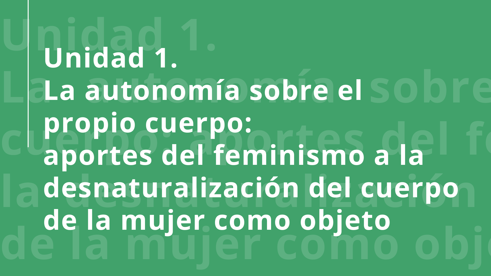
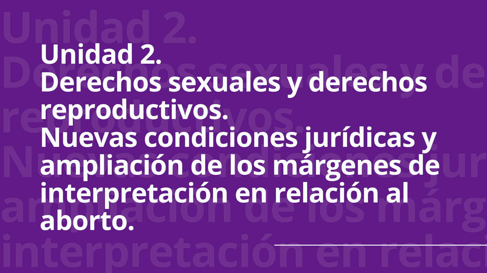

## Acceso a la interrupción voluntaria del embarazo en Argentina: aportes e las ciencias sociales y el activismo feminista

##### FACULTAD DE CIENCIAS SOCIALES - UBA  
##### CÁTEDRA DELVILE

Nos proponemos con esta materia dar respuesta a la necesidad de formación en el tema de las futuras profesionales de las Ciencias Sociales, aportando herramientas teórico metodológicas para el abordaje de la problemática del aborto en Argentina desde una perspectiva de género y de derechos humanos, de los que los derechos sexuales y los derechos reproductivos son parte.

Cabe destacar que respecto de las/os estudiantes de Trabajo Social, muchas se insertarán posteriormente, como profesionales, en el sistema de salud y como refiere la Ley Federal de Trabajo Social (nº 27.072), el ejercicio de nuestra profesión debe fundarse en la defensa, reivindicación y promoción del ejercicio efectivo de los derechos humanos y sociales, asimismo reconoce la necesidad de capacitarse y actualizarse en el campo disciplinario del trabajo social y de las ciencias sociales. Por otro lado, muchas/os trabajadores/as sociales y sociólogos/as trabajan en el sistema educativo, tanto como docentes como en equipos socio educativos. Y profesionales de todas las disciplinas se desempeñan en áreas de gestión y de investigación.

Por tal motivo, que las estudiantes puedan adentrarse en el análisis de la problemática del aborto, su contexto socio-histórico, su aspecto legal y epidemiológico, resulta central para avanzar hacia la apropiación de herramientas que les permitan no solo reflexionar acerca del rol profesional sino también fundar sólidamente sus acciones a fin de desarrollar un ejercicio profesional que cotidianamente se pronuncie a través de sus prácticas en la defensa de los derechos de las personas gestantes. Esto permitirá encarar en mejores condiciones las tensiones y confrontaciones que se dan en los espacios institucionales en los que nos insertamos, así como los procesos de intervención con las personas en situación de aborto.

### Cohorte 2020

