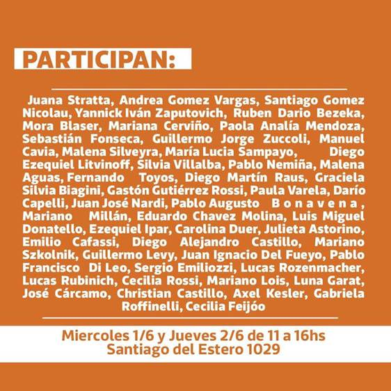

## Posta sociológica PASALAVOS(Z) 📢 Celebración y socialización del conocimiento

El 1ro. de junio se conmemora el día del Sociólogx en homenaje a la primera Cátedra de Sociología en Argentina, dictada en el año 1899 por Antonio Dellepiane. 

Desde la carrera de sociología de la UBA en conmemoración de la fecha, realizaron una nueva edición de sociología  en vivo a nivel interclaustros invitando a _presentar un libro en 8 minutos sobre el  autor o autora que, dentro del campo de nuestra disciplina, te interpeló, te dejó pensando, te ofreció una nueva mirada o nuevas perspectivas. En fin, el libro que “te voló la cabeza”. La idea es que que podamos celebrar el conocimiento socializando lecturas y dejando un aporte para seguir pensando, para aprender y para conocer nuevxs autorxs._

## Pan y Afectos - Elizabeth Jelin

## Sociología en vivo - participantes

