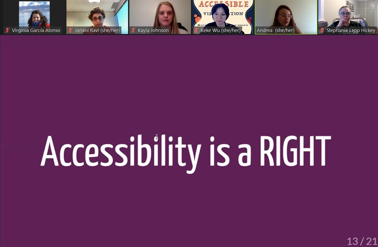

## R-Ladies East Lansing bloghosting a virtual Accessible DataViz Meetup

_Come learn how to make your data visualizations & presentations accessible to everyone._

_Our first speaker, [Keke Wu](https://www.kekewu.me/) (PhD student at Univ of Colorado, Boulder) will talk about her research, Understanding Data Accessibility for People with Intellectual and Developmental Disabilities (IDD), giving us concrete ideas about how to make better figures and reach the IDD community._

_Our second speaker,Andrea Gomez Vargas (one of the winners of the ‘most accessible presentation’ award at useR! 2021), will talk about how to make an accessible presentation in R, using packages such as RMarkdown._

### Learning accessibility in community

On this occasion I will tell you a little about our experience while preparing a talk for [**useR2021**](https://soyandrea.netlify.app/publication/user2021/) and what accessibility practices we applied to our presentation, which may be useful to you when preparing a presentation using R. 

Thank you very much Rladies from East Lansing for this invitation and for allowing us to share our experience! This presentation was also done as a group. 

<blockquote class="twitter-tweet">
The presentation material (<a href="https://twitter.com/kekewu728?ref_src=twsrc%5Etfw">@kekewu728</a> <a href="https://twitter.com/me_andre?ref_src=twsrc%5Etfw">@me_andre</a>) is now available on GitHub: <a href="https://t.co/APLLqtj7M1">https://t.co/APLLqtj7M1</a> Looking forward to learning more about Accessible DataViz tonight! See you all there! 🙌
&mdash; R-Ladies East Lansing (@RLadiesELansing) <a href="https://twitter.com/RLadiesELansing/status/1488157260719087616?ref_src=twsrc%5Etfw">January 31, 2022</a></blockquote> 
