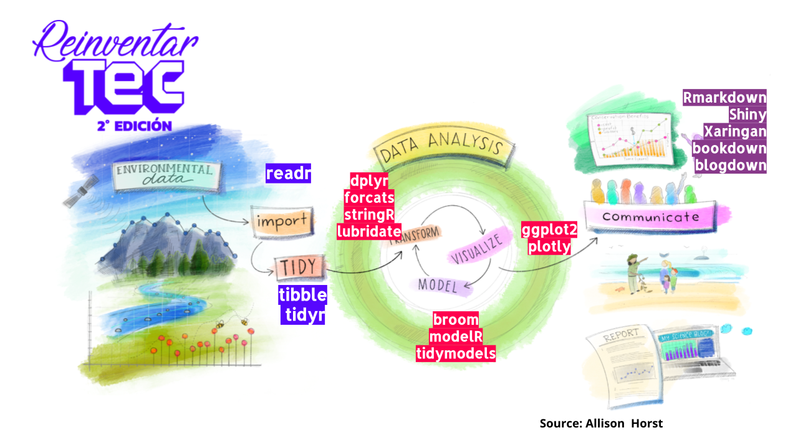
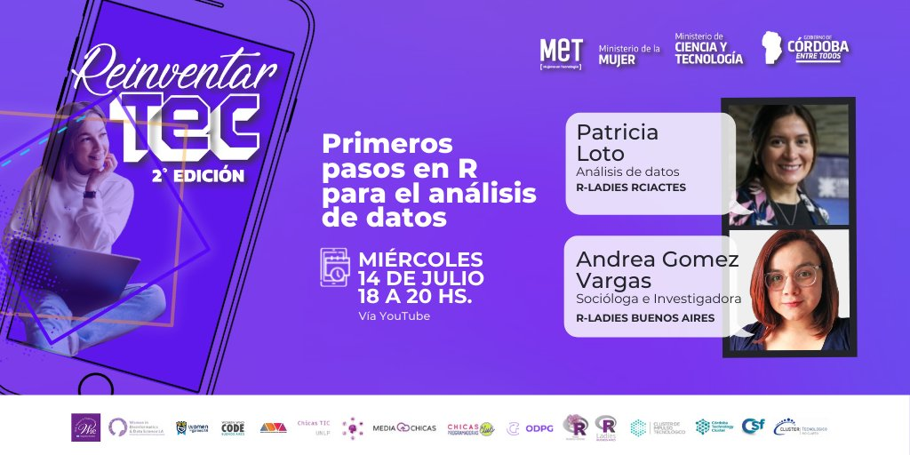

## **Primeros pasos en R para el análisis de datos**

#### ReinventarTEC 2021 - taller 

Taller organizado por los capítulos de Rladies Buenos Aires, Ushuaia y Resistencia-Corientes para la segunda edición de ReinventarTEC. Un ciclo de talleres con el fin de inspirar a mujeres de todas las edades y profesiones a reinventarse y crear un mejor futuro laboral en la era digital. 

En esta ocasión quisimos brindar tips y materiales iniciales, gratuitos y accesibles para empezar a hacer análisis de datos con una pequeña introducción para aprender a usar R y tidyverse.

Para que no quedara solo conceptos, realizamos un ejercicio práctico con un dataset sobre LEGO. Te comparto los links con la presentación y ejercicio de práctica.

**Práctica Rstudio desde la nube:**  https://rstudio.cloud/project/2704255 

**Presentación + Guía de instalación Rstudio:** https://bit.ly/Taller9-ReinventarTEC

<iframe width="560" height="315" src="https://www.youtube.com/embed/Q8kKAnB3Xf8" title="YouTube video player" frameborder="0" allow="accelerometer; autoplay; clipboard-write; encrypted-media; gyroscope; picture-in-picture" allowfullscreen></iframe>

+ info: https://mincyt.cba.gov.ar/reinventartec/

**Difusión**

