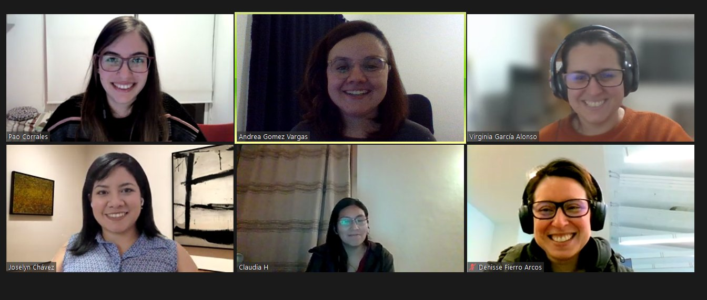

## Uso de R en Latinoamérica: fortalezas, desafíos y debilidades

__Regular talk - Community and Outreach__

### **¿De que se trató esta iniciativa?**

Sabemos que el entorno de R es utilizado globalmente para diversos fines. Sin embargo, ¿qué tan ampliamente es utilizado en países periféricos como los Latinoamericanos donde el inglés no es el idioma oficial y donde la infraestructura y el  acceso a diversos recursos no están garantizados entre otros? 

En agosto de 2020 un grupo de personas pertenecientes a comunidades de usuarios y usuarias de R en Latinoamérica, nos propusimos generar una encuesta para conocer a las personas que usan R en Latinoamérica, intentando resaltar cuáles son nuestras posibles fortalezas y a qué desafíos nos enfrentamos. 

Con base en los objetivos propuestos, diseñamos una encuesta de 31 preguntas las cuales abordaban 5 ejes principales: su interés en R, información demográfica, su nivel académico, su relación con la comunidad de R y el área en que usan R. 

Con la finalidad de fomentar la inclusividad, la encuesta fue confeccionada en tres idiomas español, portugués e inglés para que las personas contestaran en el idioma con el que se sintieran más cómodas. 

La iniciativa fue difundida en numerosas redes como Twitter, Slack y Telegram de grupos que trabajan con R. Para esta encuesta se invitó a participar a quienes hayan nacido y/o sean residentes en Latinoamérica. 

Este pequeño proyecto creció gracias al gran trabajo y colaboración de muchas personas que sumaron preguntas, ayudaron a corregir errores y generaron las distintas traducciones para que esté disponible en español, portugués e inglés y tenga en cuenta la diversidad de realidades en la región. 
Pero además pasó a ser un proyecto de R-Forwards, el grupo de trabajo de la R Foundation que busca mejorar la inclusión y diversidad en el mundo de R.

Slides en [**español**](https://encuesta-user2021-es.netlify.app/#1) e  [**inglés**](https://encuesta-user2021-en.netlify.app/#1)

**Equipo**:
Paola Corrales (CIMA, FCEN, UBA), 
Claudia A. Huaylla (IRNAD-CONICET-UNRN),
Virginia A. García Alonso (IBBEA-CONICET-UBA),
Joselyn Chávez (IBt-UNAM),
Denisse Fierro Arcos (IMAS-UTAS),
Andrea Gómez Vargas (FSOC, UBA).

